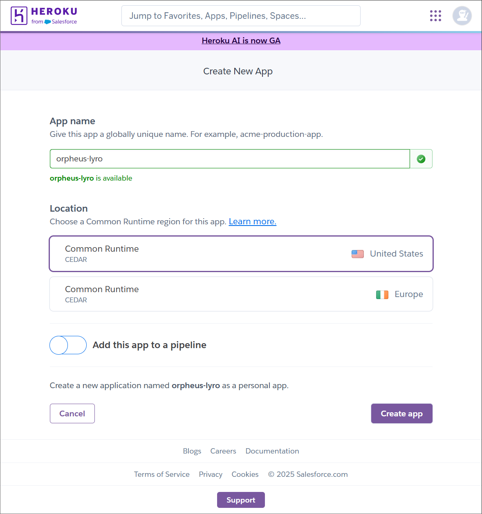

# Orpheus Lyre

## 제목

> OpenAI를 이용한 컨텐츠 필터링 api 서버 개발

## 목적

- 커뮤니티 사이트에 사용자가 게시물을 작성할 때, 부적절한 단어 사용을 완전히 방지하는 것은 현실적으로 보장하기 어렵다. 이러한 플랫폼에서 모든 게시글을 관리자들이 직접 모니터링하고 필터링하며 삭제하는 작업은 상당한 인적·시간적 비용과 운영 부담을 초래한다.

- 본 API는 사용자가 작성한 게시글이 서버(DB)에 저장되기 이전 단계에서 부적절한 언어를 자동으로 감지하여 검출 결과를 반환함으로써, 효과적인 사전 검열 및 콘텐츠 품질 관리를 지원하도록 설계되었다.

## 시나리오


1. 사용자가 api server에 필터링할 컨텐츠를 전송한다.

```json
{
  "title": "Lorem ipsum dolor sit amit",
  "content": "Set tincidunt tortor nex..."
}
```

2. TypeScript와 expressjs로 개발한 api 서버에서 관리자의 API-KEY를 이용하여 작성된 prompt language로 platform.openai.com에 요청한다.

```
아래내용을 확인해줘
```

3. platform.openai.com에서 받는 내용을 양식에 맞춰 사용자에게 반환한다.

```json
{
  "success": true,
  "message": "message from server",
  "data": {
    "density": 99,
    "title": "Lorem ipsum dolor sit amit",
    "content": "Set tincidunt tortor enc...",
    "title-fix": "Lorem ipsum dolor sit amit",
    "content-fix": "Set tincidunt tortor nec..."
  },
  "error": {
    "type": "Lorem ipsum dolor sit amit",
    "code": 99,
    "message": "Lorem ipsum dolor sit amit",
    "trace_id": "TRA-124"
  }
}
```

## GitHub 에 프로젝트 생성


## Heroku 에 프로젝트 생성



## GitHub와 Heroku 연동


## 프로젝트 생성

1. noveenv
2. expressjs + typescript
3. setup multiple env file by staging
4. Prettier + ESLint
5. Procfile

```typescript
import express, { Express, Request, Response } from "express";
import dotenv from "dotenv";

dotenv.config({ path: [".env", `.env.${process.env.NODE_ENV}`] });

const app: Express = express();
const port = process.env.EXPRESSJS_PORT;

app.get("/", (req: Request, res: Response) => {
  res.send("Express + TypeScript Server");
});

app.listen(port, () => {
  console.log(`⚡️[server]: Server is running at http://localhost:${port}`);
});
```

**_ Heroku 서버 포트번호는 34381 이다._**

## 프로젝트 배포


1. Depolyment method 에서 GitHub를 선택후 프로젝트를 연결한다.
2. menual deploy 에서 branch를 선택한 후 Depoly Branch를 클릭한다.

## 프로젝트 개발

https://github.com/sangmeow/orpheus-lyre

## 배포 후 결과 및 url 확인


배포가 정상적으로 완료된 것을 확인하고 [View]를 클릭하여 url을 확인한다.

## 결과
