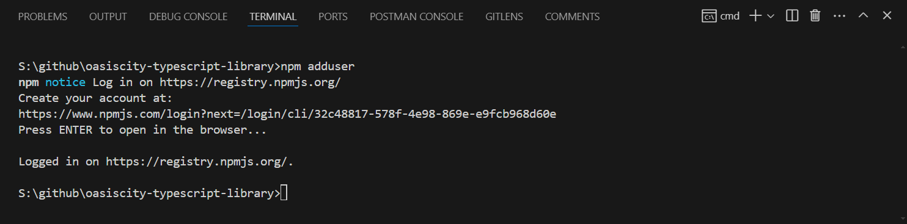
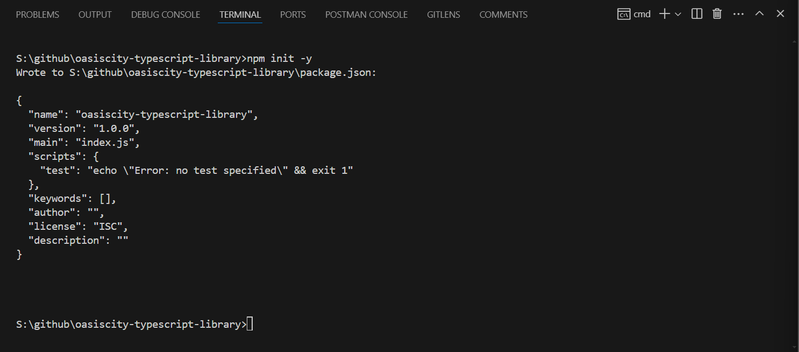

# TYPESCRIPT NPM PACKAGE

### Authenticate terminal with npm.
```
> npm adduser
```


### CREATE NODE PROJECT
```
> npm init -y
```


```json
{
  "name": "oasiscity-typescript-library",
  "description": "oasiscity-typescript-library",
  "version": "1.0.0",
  "author": "sickdog.oasiscity",
  "main": "./dist/index.js",
  "types": "./dist/index.d.ts",
  "scripts": {
    "test": "jest",
    "build": "tsc -p ."
  },
  "repository": {
    "type": "git",
    "url": "https://github.com/sangmeow/oasiscity-typescript-library"
  },
  "keywords": [
    "library",
    "typescript"
  ],
  "license": "MIT",
  "dependencies": {
    "typescript": "^5.5.2"
  },
  "devDependencies": {
    "@biomejs/biome": "1.8.2",
    "@types/jest": "^29.5.12",
    "globals": "^15.6.0",
    "jest": "^29.7.0",
    "ts-jest": "^29.1.5"
  }
}
```

```main```and ```types``` value must give correct directory path.

```bash
> npm install -g typescript
> yarn install
```

### CREATE TYPESCRIPT PROJECT
```bash
> npx tsc --init
```
```json
{
  "compilerOptions": {
    /* Visit https://aka.ms/tsconfig to read more about this file */
    "target": "es2016" /* Set the JavaScript language version for emitted JavaScript and include compatible library declarations. */,
    "module": "commonjs" /* Specify what module code is generated. */,
    "declaration": true /* Generate .d.ts files from TypeScript and JavaScript files in your project. */,
    "declarationMap": true /* Create sourcemaps for d.ts files. */,
    "sourceMap": true /* Create source map files for emitted JavaScript files. */,
    "outDir": "./dist" /* Specify an output folder for all emitted files. */,
    "esModuleInterop": true /* Emit additional JavaScript to ease support for importing CommonJS modules. This enables 'allowSyntheticDefaultImports' for type compatibility. */,
    "forceConsistentCasingInFileNames": true /* Ensure that casing is correct in imports. */,
    "strict": true /* Enable all strict type-checking options. */,
    "noImplicitAny": true /* Enable error reporting for expressions and declarations with an implied 'any' type. */,
    "skipLibCheck": true /* Skip type checking all .d.ts files. */
  },
  "include": ["src/**/*.ts"] /* Add the path to your TypeScript file or directory here */,
  "exclude": ["node_modules", "**/*.test.{js,ts}", "nodeenv-18.20.0"]
}
```

### ADD TYPESCRIPT DEPENDENCY

```bash
> npm install --include=dev typescript
```

### ADD DEFAULT TYPESCRIPT FILE

```src/index.ts```

# ESLINT

```bash
> yarn add --include=dev eslint @typescript-eslint/parser @typescript-eslint/eslint-plugin
```

```bash
> npx eslint --init
```

```eslint.config.mjs``` file will be shown.

```bash
import globals from "globals";
import pluginJs from "@eslint/js";
import tseslint from "typescript-eslint";

export default [
  {files: ["**/*.{js,mjs,cjs,ts}"]},
  {languageOptions: { globals: globals.browser }},
  pluginJs.configs.recommended,
  ...tseslint.configs.recommended,
];
```

# PRETTIER

```bash
> yarn add --dev prettier
```

```bash
> npm prettier .
```

Create ```.prettierrc``` file and root directory.

```json
{
  "bracketSpacing": false,
  "endOfLine": "auto",
  "tabWidth": 2,
  "printWidth": 140
}
```

# JEST

```bash
> yarn add --dev jest
```

### ts-jest

ts-jest is a TypeScript preprocessor with source map support for Jest that lets you use Jest to test projects written in TypeScript.

```bash
> yarn add --dev jest typescript ts-jest @types/jest
```

### config jest

```bash
> npx ts-jest config:init
```

```jest.config.js```

```javascript
export default {
  preset: "ts-jest",
  testEnvironment: "node",
};
```

```
> npm run test -- index.test.ts
```

# VSCODE CONFIG

Create ```.vscode``` folder and create ```settings.json``` file.

```json
{
  "editor.tabSize": 2,
  "editor.defaultFormatter": "esbenp.prettier-vscode",
  "editor.formatOnSave": true,
  "editor.formatOnPaste": true,
  "editor.formatOnType": true
}
```

# BIOME

First, download extenstion.
Add setting code.

```bash
> yarn add --dev --exact @biomejs/biome
> yarn biome init
```

```biome.json```

```json
{
	"$schema": "https://biomejs.dev/schemas/1.8.2/schema.json",
	"organizeImports": {
		"enabled": true
	},
	"formatter": {
    "enabled": true,
    "indentStyle": "tab",
    "lineWidth": 180
	},
	"linter": {
		"enabled": true,
		"rules": {
			"recommended": true
		}
	}
}

```