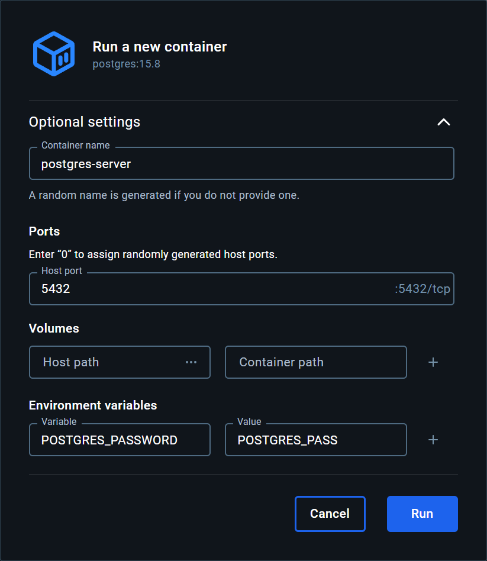
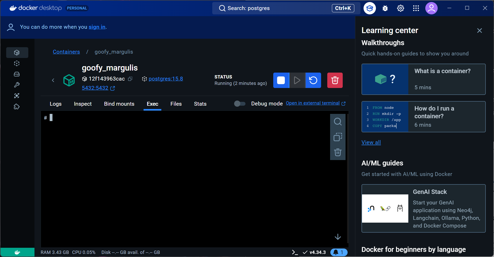
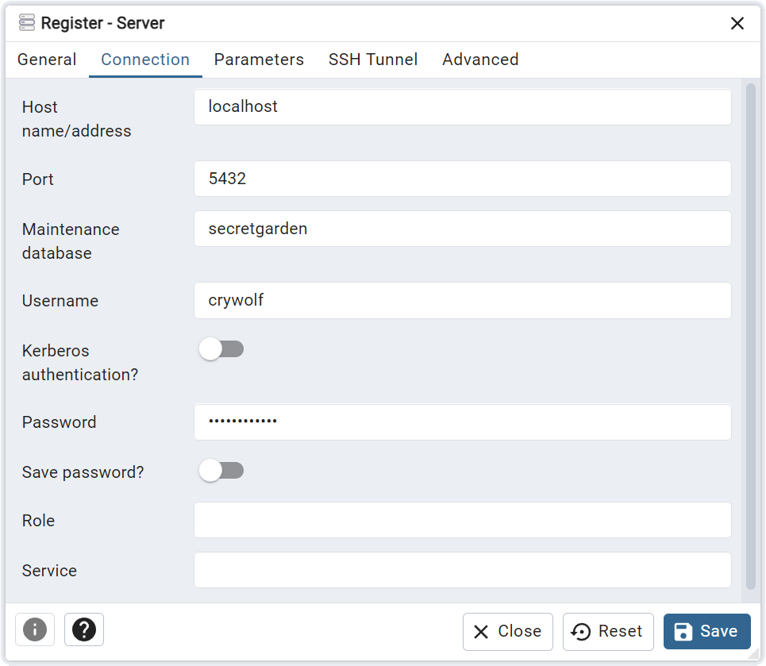

# POSTGRESQL DOCKER

Pull `posgres` images version ~~15.8~~ `16.4-bookworm`


Run `image` by clicking `play` icon


Run `container` after setting configurations



Enter docker `terminal`



```

```

# SET POSTGRESQL CONFIG
```
  # cat /etc/*-release
PRETTY_NAME="Debian GNU/Linux 12 (bookworm)"
NAME="Debian GNU/Linux"
VERSION_ID="12"
VERSION="12 (bookworm)"
VERSION_CODENAME=bookworm
ID=debian
HOME_URL="https://www.debian.org/"
SUPPORT_URL="https://www.debian.org/support"
BUG_REPORT_URL="https://bugs.debian.org/"
  # apt update
  # apt install vim
  # vim --version
```

# POSTGRES CONFIG
```
// postgres config 설정 파일 위치
vi /var/lib/postgresql/data/postgresql.conf
vi /var/lib/postgresql/data/pg_hba.conf
```

# CREATE POSTGRES SERVER
```
# localedef -f UTF-8 -i ko_KR ko_KR.UTF-8
# psql -U postgres
postgres=# ALTER USER postgres PASSWORD 'Password$123';
ALTER ROLE

// DB 생성
postgres=# CREATE DATABASE secretgarden ENCODING utf8 LC_COLLATE 'C' ALLOW_CONNECTIONS true CONNECTION_LIMIT 128 TEMPLATE template0;
// 사용자 생성 및 권한 설정
postgres=# CREATE USER sickdog WITH PASSWORD 'Password$123' NOSUPERUSER CREATEDB CREATEROLE INHERIT LOGIN;
postgres=# ALTER DATABASE secretgarden OWNER TO sickdog;
postgres=# GRANT ALL ON DATABASE secretgarden TO sickdog;
postgres=# \q
# psql -U sickdog secretgarden
// 스키마 생성
postgres=# CREATE SCHEMA IF NOT EXISTS gardener;
postgres=# CREATE SCHEMA IF NOT EXISTS garden;
// crywolf 계정 생성
postgres=# CREATE USER crywolf WITH PASSWORD 'Password$123';
postgres=# GRANT CONNECT ON DATABASE secretgarden TO crywolf;
postgres=# GRANT SELECT, INSERT, UPDATE ON ALL TABLES IN SCHEMA gardener, garden TO crywolf;
// 사용자 목록
postgres=# \du+
// uuid 추가
postgres=# CREATE EXTENSION IF NOT EXISTS "uuid-ossp";
postgres=# CREATE EXTENSION IF NOT EXISTS pg_trgm;
postgres=# CREATE EXTENSION IF NOT EXISTS btree_gin;
postgres=# SELECT * FROM pg_available_extensions;
// 종료
postgres=# \q (역슬래시)
```
- collate는 문자열 목록을 정렬하기 위한 설정으로 “C”는 collation을 사용하지 않겠다고 설정하는 것이다.
- LC_CTYPE in POSIX is related to the functions in [ctype.h](http://pubs.opengroup.org/onlinepubs/009604599/basedefs/ctype.h.html) Postgres is strongly influenced by POSIX in that matter and uses a per-database `lc_ctype` more or less like POSIX uses `LC_CTYPE`.

# CONNECT BY PGADMIN

