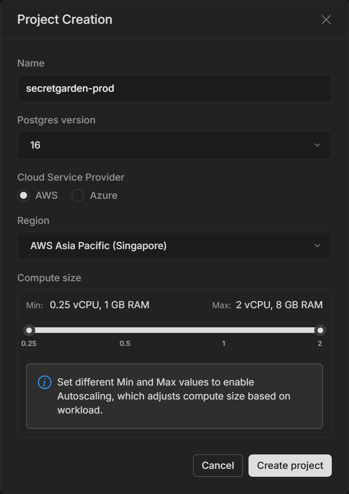

# CREATE DATABASE




## CREATE DATABASES

```sql
CREATE DATABASE secretgarden ENCODING utf8 LC_COLLATE 'C' ALLOW_CONNECTIONS true CONNECTION_LIMIT 128 TEMPLATE template0;

-- switch to secretgarden database
CREATE SCHEMA IF NOT EXISTS gardener;
CREATE SCHEMA IF NOT EXISTS garden;

CREATE USER sickdog WITH PASSWORD 'R0M2oMu$TDi3' NOSUPERUSER;
GRANT ALL ON DATABASE secretgarden TO sickdog;

GRANT CONNECT ON DATABASE secretgarden TO sickdog;
GRANT USAGE ON SCHEMA gardener, garden TO sickdog;
GRANT SELECT, INSERT, UPDATE ON ALL TABLES IN SCHEMA gardener, garden TO sickdog;
GRANT USAGE ON SEQUENCE gardener.admin_idx_seq, gardener.refresh_token_idx_seq, gardener.user_idx_seq, garden.board_idx_seq, garden.code_idx_seq, garden.comment_idx_seq, garden.lounge_idx_seq TO sickdog;

CREATE EXTENSION IF NOT EXISTS "uuid-ossp";
CREATE EXTENSION IF NOT EXISTS pg_trgm;
CREATE EXTENSION IF NOT EXISTS btree_gin;
```

## CONNECT POSTGRES SERVER

dev : ep-black-cloud-a15liko2.ap-southeast-1.aws.neon.tech
prod : ep-empty-wind-a1v0891w.ap-southeast-1.aws.neon.tech

[DB]secretgarden 디렉토리에서 모든 sql을 등록한다. [대상 DB: secretgarden]
